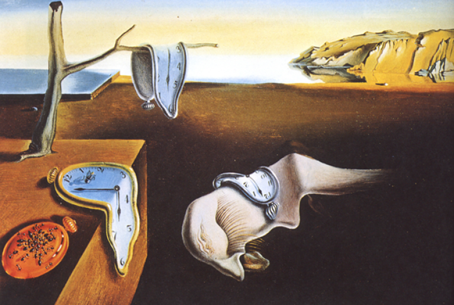

# Sample Markdown

# Heading

This file contains some example markdown syntax, more can be found all over the [internet](https://github.com/adam-p/markdown-here/wiki/Markdown-Cheatsheet).

## Sub Heading 1

It's a _hug_, Michael. I'm **hugging** you. That's why you always leave a note! But I bought a yearbook ad from you, doesn't that mean anything anymore? Army had half a day.

[I hear the jury's still out on science](http://arresteddevelopment.wikia.com/wiki/G.O.B.). Whoa, this guy's straight? Across from where? There's only one man I've ever called a coward, and that's Brian Doyle Murray. No, what I'm calling you is a television actor.

### Sub Heading 2

He'll want to use your yacht, and I don't want this thing smelling like fish. I don't understand the question, and I won't respond to it. I'm half machine. I'm a monster. Steve Holt!

## Quote/Note

> This is a quote or more commonly used as a notification box. You can use **bold**, _italics_ and [links](http://google.com) here too.

## Images

Images will be converted into binary format and embedded in the document so they can be viewed offline. Image paths are relative to the location of the markdown file. 



## Lists

### Numbered Lists

1. Task A
2. Task B
3. Task C

### Unordered lists

* Salt
* Pepper
* Sugar

## References

Reference style links can be made using the `^` character in reference style links[^1]. The numbering[^3] will be sorted out automatically if the references are numbered in the wrong order[^2].

[^1]: [First reference](#)
[^3]: [Second reference](#)
[^2]: [Third reference](#)

## Code

```python
import os

def main():
    print('Hello World')

main()
```

## Table

Column 1 | Column 2 | Column 3
--- | --- | ---
A | B | C
1 | 2 | 3
D | E | F
4 | 5 | 6


## Mathematic equation

Uses [MathJax](https://www.mathjax.org/) for rendering and [TeX](https://en.wikipedia.org/wiki/TeX) syntax for markup. Automatically detects lines enclosed with `$$` and adds the library if it is detected. Only display format is supported, not single `$` inline format. Note also that the equation must have newlines preceding and following it to render properly. 

$$
e^{i\pi} = -1
$$

$$\sum_{i=0}^n i^2 = \frac{(n^2+n)(2n+1)}{6}$$
